# Tech Challenge Fase 3 — Predição de risco educacional por escola (IDEB)

Projeto da Fase 3 da pós-graduação em Ciência de Dados. Construí um modelo supervisionado de classificação binária que prevê se uma escola pública brasileira atinge a meta nacional do IDEB nos anos iniciais do Ensino Fundamental, a partir de variáveis de infraestrutura, corpo docente, gestão e contexto territorial da própria escola. O resultado do modelo é convertido numa lista de escolas priorizadas por risco, que é o que um gestor público consegue usar na prática.

Resumo do que está aqui: pipeline completo de dados (ingestão do S3, junção Censo Escolar x IDEB, seleção de features), pipeline de machine learning em scikit-learn (imputação, encoding e modelo integrados, sem vazamento entre treino e validação), comparação de quatro algoritmos com busca de hiperparâmetros, interpretabilidade com Feature Importance, Permutation Importance e SHAP, e as respostas às cinco perguntas de negócio do enunciado. Todo o caminho de decisão está documentado, inclusive as decisões que foram revistas.

## Sumário

1. [Contexto do problema](#1-contexto-do-problema)
2. [Objetivo analítico](#2-objetivo-analítico)
3. [Descrição da base utilizada](#3-descrição-da-base-utilizada)
4. [A reformulação do problema: de aluno para escola](#4-a-reformulação-do-problema-de-aluno-para-escola)
5. [Etapas de modelagem](#5-etapas-de-modelagem)
6. [Escolha do algoritmo](#6-escolha-do-algoritmo)
7. [Métricas de avaliação](#7-métricas-de-avaliação)
8. [Interpretação dos resultados](#8-interpretação-dos-resultados)
9. [Insights encontrados](#9-insights-encontrados)
10. [Limitações do projeto](#10-limitações-do-projeto)
11. [Aplicação prática para políticas públicas](#11-aplicação-prática-para-políticas-públicas)
12. [Implantação em produção (proposta)](#12-implantação-em-produção-proposta)
13. [Possíveis evoluções futuras](#13-possíveis-evoluções-futuras)
14. [Como reproduzir](#14-como-reproduzir)
15. [Estrutura do repositório e documentação](#15-estrutura-do-repositório-e-documentação)

## 1. Contexto do problema

A alfabetização infantil é um dos principais indicadores de desenvolvimento educacional e social do país, mas olhar só o dado atual não basta para quem decide política pública: o gestor precisa antecipar risco, saber onde intervir primeiro e entender quais fatores pesam mais no resultado. O desafio desta fase é usar os dados tratados na Fase 2 (camada Gold de um pipeline de engenharia de dados sobre o Indicador Criança Alfabetizada e fontes complementares) para produzir inteligência analítica aplicada a esse problema.

## 2. Objetivo analítico

Prever, por escola, se ela atinge a meta de referência do IDEB (Índice de Desenvolvimento da Educação Básica, calculado pelo INEP) nos anos iniciais do Ensino Fundamental, e transformar essa previsão em uma priorização de escolas para intervenção.

- **Unidade de predição (grão):** escola.
- **Variável-alvo:** `alvo_ideb = 1` se o IDEB da escola é maior ou igual a 6,0 (a meta nacional de referência do MEC/INEP), `0` caso contrário. Na base final, 54,8% das escolas batem a meta.
- **Recorte:** IDEB "Anos Iniciais" (1º ao 5º ano, avaliado no fim do 5º ano), escolas da rede pública, ciclo 2025 do IDEB pareado com o Censo Escolar de 2024.
- **Perguntas de negócio respondidas** (em `reports/insights.md`): quais fatores mais impactam o resultado, quais municípios e regiões concentram maior risco, quais regiões têm padrões parecidos, como identificar escolas que podem não atingir a meta, e quais variáveis mais influenciam o modelo.

## 3. Descrição da base utilizada

Os dados vêm do S3 do projeto da Fase 2, lidos com `boto3`:

| Fonte | Camada | Papel no projeto |
|---|---|---|
| `br_inep_censo_escolar.escola_completo` | Bronze | Características da escola (342 colunas no parquet: infraestrutura, corpo docente, matrícula, gestão, modalidade). Censo 2024. |
| `br_inep_ideb.escola` | Bronze | IDEB por escola, por ciclo bienal. Fonte da variável-alvo. |
| `br_inep_censo_escolar.dicionario` | Bronze | Dicionário oficial código → texto, usado para decodificar as categóricas do Censo. |
| `alunos` (Silver) e Gold de infraestrutura municipal | Silver / Gold | Usadas só na análise exploratória inicial, no grão de aluno (ver seção 4). |

A base de modelagem é montada por `src/preprocessing/build_base_escola.py`: junção Censo x IDEB por `id_escola` (95,9% das escolas do IDEB encontram par no Censo), filtros de rede pública, anos iniciais e ano de referência, tradução das categóricas pelo dicionário oficial e publicação de uma camada própria no S3 (`silver_modelo`). Resultado: 63.537 escolas, das quais **42.273 têm IDEB publicado** e entram no treino e na validação. As demais podem ser pontuadas pelo modelo depois (é o que `src/modeling/prever.py` faz).

Das 348 colunas da base, sobraram **47 features** (38 numéricas e 9 categóricas) depois de um funil de seleção documentado coluna a coluna em `reports/referencias/selecao_features_revisado.csv`.

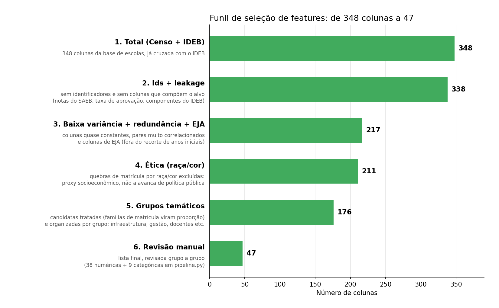

## 4. A reformulação do problema: de aluno para escola

O enunciado fala em prever "se um aluno será alfabetizado", e foi por aí que comecei, com a base de ~3,9 milhões de alunos. A análise exploratória (`notebooks/eda/01_eda.ipynb`) mostrou três coisas com número real:

1. A base de aluno tem pouquíssima informação genuinamente individual (`serie`, `rede`, `presenca`, `preenchimento_caderno`), e as duas últimas são leakage estrutural: quem falta à prova é automaticamente contado como não alfabetizado.
2. Quase todo o poder preditivo restante vinha de dados de município, repetidos para todos os alunos do mesmo município. Uma camada agregada por município não consegue diferenciar escolas.
3. `proficiencia` reproduz `alfabetizado` por uma regra de corte (743 pontos do SAEB), então não pode ser feature.

Fui então atrás da informação mais granular disponível, a tabela de escola do Censo Escolar, e encontrei dois obstáculos reais: o `id_escola` da base de alunos usa um sistema de código diferente do Censo (0% de interseção, sem crosswalk), e a tabela de escola não tem nenhuma variável de resultado. A saída foi buscar uma fonte externa de desempenho por escola, o IDEB, cujo `id_escola` bate com o Censo. Antes de adotá-lo, verifiquei que o IDEB não incorpora informação de infraestrutura (recalculei a fórmula oficial em 787 mil linhas; a diferença residual é só arredondamento), o que garante que features e alvo vêm de fontes independentes.

O grão de escola também é o mais acionável: um gestor não intervém em um aluno específico de forma sistemática, mas consegue investir em uma escola. O passo a passo dessa investigação, com as alternativas que considerei e descartei (modelo em duas etapas com score de município, recuo para o grão de município), está em `notebooks/eda/README.md` e na seção "Reflexão" de `reports/decisoes.md`.

## 5. Etapas de modelagem

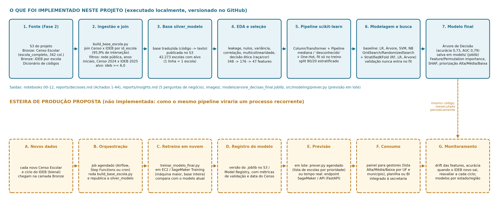

**Tratamento de leakage.** Ficam fora das features os identificadores, as colunas que compõem o próprio IDEB (`taxa_aprovacao`, `indicador_rendimento`, notas do SAEB) e, no grão de aluno, `proficiencia`, `presenca` e `preenchimento_caderno`. Toda estatística de imputação e encoding é ajustada só no treino, dentro do `Pipeline`.

**Seleção de features** (`notebooks/eda/08_selecao_features_escola.ipynb`): exclusão de identificação e alvo → corte de colunas com mais de 50% de nulos → filtro de baixa variância (95%) → exclusão das colunas de EJA → remoção de multicolinearidade e das famílias compositivas de matrícula (sexo, raça, idade, turno somam o total de matrícula) → decisão ética de excluir as colunas de raça/cor (a contagem de alunos brancos era a variável mais correlacionada com o IDEB, um proxy socioeconômico que não é acionável por política pública) → conversão de contagem em proporção só onde fazia diferença → revisão manual por grupo temático. `sigla_uf` e `rede` entram como categóricas.

**Pré-processamento integrado ao modelo** (`src/preprocessing/pipeline.py`): `ColumnTransformer` com `SimpleImputer(median)` para numéricas (com `StandardScaler` só para os modelos sensíveis a escala) e `SimpleImputer(constant="desconhecido")` + `OneHotEncoder(handle_unknown="ignore")` para categóricas, dentro de um `Pipeline` do scikit-learn com o classificador. O código 9 ("não informado" no Censo) vira nulo antes da imputação.

**Divisão dos dados.** `train_test_split` 80/20 estratificado, `random_state=42`. Toda busca de hiperparâmetro roda com `StratifiedKFold` (5 folds) dentro dos 80% de treino; os 20% de validação nunca entram em nenhum `.fit()` e só são usados para reportar a generalização de cada modelo já treinado.

**Baseline** (`notebooks/modelagem/09_baseline_classificacao.ipynb`): Regressão Logística, Árvore de Decisão, SVM e Naive Bayes com hiperparâmetros padrão.

**Otimização** (`notebooks/modelagem/10_otimizacao_modelo.ipynb` e `11_otimizacao_avancada_arvore.ipynb`): `GridSearchCV`/`RandomizedSearchCV` para Árvore, Random Forest e Regressão Logística; SVM mantido na versão básica (a busca custava 17 minutos para ficar atrás do Random Forest). Para a Árvore, uma segunda busca com 400 combinações, `ccp_alpha` em escala logarítmica e diagnóstico explícito de gap treino x validação cruzada.

**Interpretabilidade e aplicação** (`notebooks/modelagem/12_interpretabilidade.ipynb`): importância nativa, Permutation Importance, SHAP (`TreeExplainer`), agregação de risco por município, UF e região, e priorização de escolas.

## 6. Escolha do algoritmo

| Modelo | Baseline (padrão) | Otimizado, acurácia média em CV | Observação |
|---|---|---|---|
| Random Forest | 0,744 | **0,7479** | melhor acurácia |
| SVM (RBF) | 0,749 | 0,7456 (sem busca) | busca de hiperparâmetro descartada pelo custo |
| Regressão Logística | 0,737 | 0,7378 | `C=10`, penalidade L1 |
| Árvore de Decisão | 0,675 (`max_depth=4`) | 0,7294 | `max_depth=None`, `min_samples_leaf=50` |
| Naive Bayes | 0,655 | descartado após o baseline | recall ruim na classe "não" |

**Modelo final: Árvore de Decisão** (`criterion="gini"`, `max_depth=None`, `min_samples_leaf=50`). A diferença de acurácia para o Random Forest é de 1,85 ponto percentual, e a árvore é o único candidato cuja regra de decisão dá para abrir e ler sem técnica pós-hoc, o que pesa num problema em que quem usa o resultado precisa explicar por que uma escola foi marcada como risco. Ela também é a mais barata de treinar e de manter.

Dois resultados da otimização merecem registro. Primeiro, o ganho da busca de hiperparâmetro em si foi pequeno para Random Forest e Regressão Logística (menos de 0,4 ponto percentual sobre os defaults); só a Árvore melhorou muito, porque o baseline usava `max_depth=4` por legibilidade. Segundo, a busca pesada da Árvore (400 combinações) encontrou uma configuração com validação cruzada ligeiramente melhor (0,7304 contra 0,7294), mas que generalizou pior na validação (0,7224 contra 0,7315, AUC 0,785 contra 0,791). Fiquei com a configuração mais simples. Numa base com relações relativamente simples entre as variáveis, otimizar mais não trouxe ganho; isso varia de problema para problema, e aqui o que fez diferença foi a construção da base e a seleção de features, não o ajuste fino.

## 7. Métricas de avaliação

O alvo é quase balanceado (54,8% x 45,2%), então uso **acurácia** como métrica principal de comparação, complementada por precisão, recall e F1 por classe (para não esconder um desequilíbrio entre "bate" e "não bate"), matriz de confusão e **curva ROC / AUC**.

| Modelo final na validação (20%, nunca usada no treino) | Valor |
|---|---|
| Acurácia | **0,7315** |
| AUC | **0,791** (baseline da árvore: 0,710) |
| Acurácia média em validação cruzada (treino) | 0,7294 |

A acurácia na validação ficou na mesma faixa da validação cruzada, sem sinal de overfitting. Sem `sigla_uf` entre as features, a acurácia cai para 0,66, o que confirma que o estado carrega sinal real e não é um artefato do encoding.

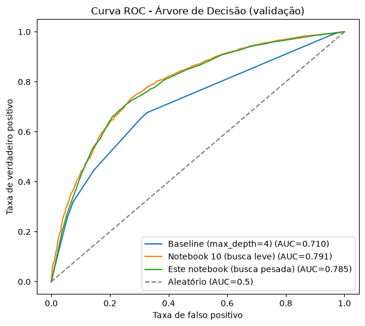

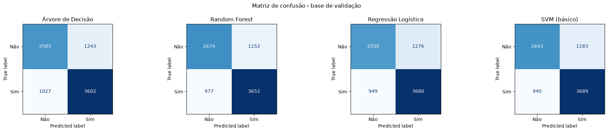

## 8. Interpretação dos resultados

Usei três técnicas que se complementam, e a leitura conjunta importa porque cada uma mede uma coisa diferente:

- **Importância nativa (Gini)** mede por coluna depois do one-hot. `acesso_internet_computador` é a feature isolada mais forte (0,176); `sigla_uf` aparece fatiada em uma coluna por estado (Paraná 0,074, Ceará 0,070, Bahia 0,068, São Paulo 0,067).
- **Permutation Importance** embaralha a coluna original antes do pré-processamento, então mede `sigla_uf` inteira: **0,142**, dez vezes a segunda colocada (`etapa_ensino_fundamental_anos_finais`, 0,014, seguida de `acesso_internet_computador`, 0,013). Para confirmar essa leitura, treinei o mesmo classificador com `sigla_uf` codificada como uma única coluna ordinal: a importância nativa dela sobe para 0,310, a maior de todas (com a ressalva de que a ordem ordinal é arbitrária, então essa versão serve só como comparação).
- **SHAP** explica escola por escola. No beeswarm, estar em São Paulo, Ceará, Paraná ou Minas Gerais empurra a previsão para "bate a meta"; estar na Bahia é o efeito negativo mais forte do gráfico. Na escola de maior risco previsto (Bahia), o estado sozinho reduz a previsão em 0,27; na escola mais segura (Paraná), o estado contribui +0,15 e o acesso à internet +0,09.

Antes das três técnicas, a própria regra da árvore já diz muito: a raiz pergunta se a escola tem acesso a internet e computador, e o corte seguinte, em cada lado, é o estado (Paraná de um lado, Bahia do outro). A árvore completa tem 23 níveis e 495 folhas com ao menos 50 escolas cada.

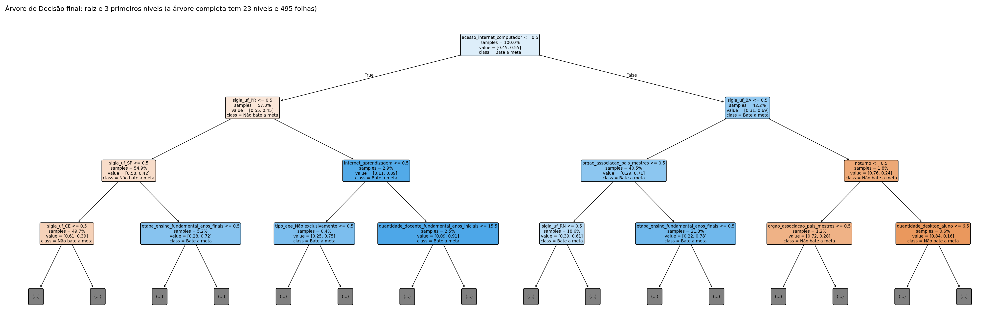

| Importância nativa | Permutation Importance |
|---|---|
| 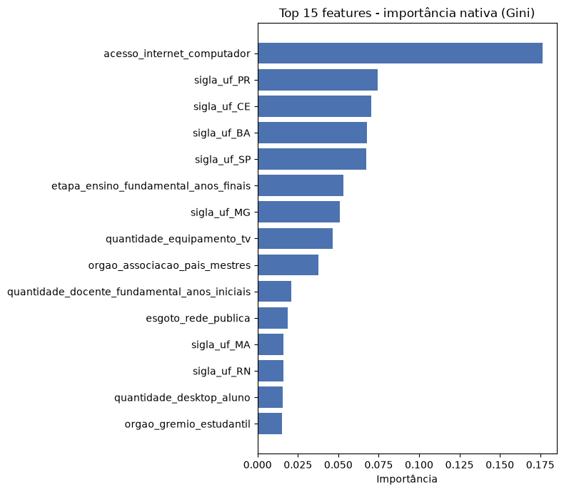 | 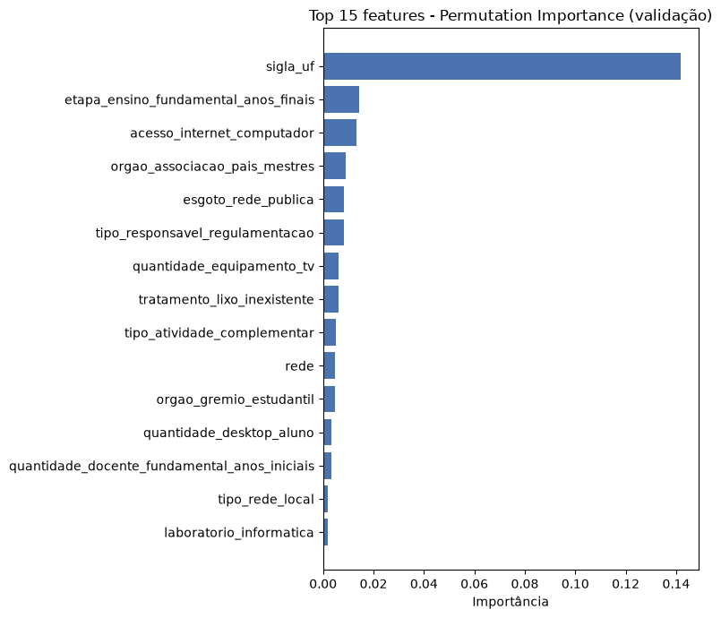 |

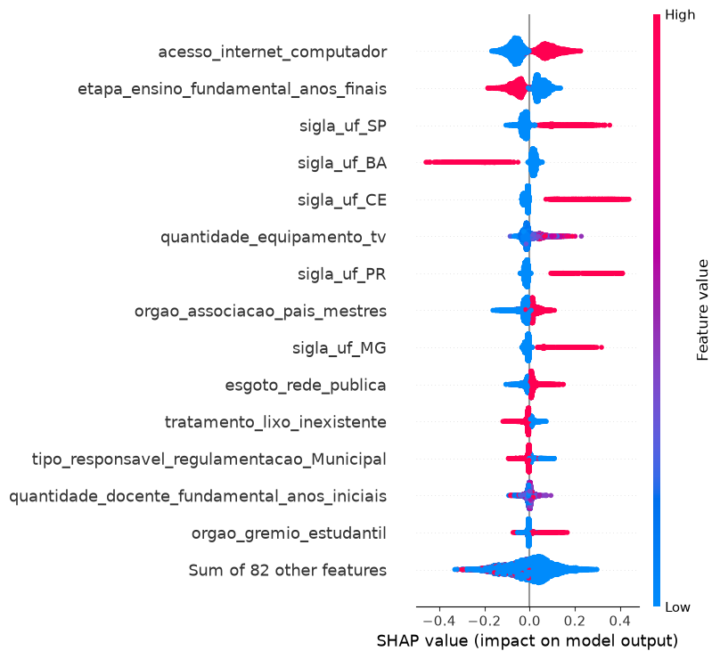

| Escola de maior risco (BA) | Escola mais segura (PR) |
|---|---|
| 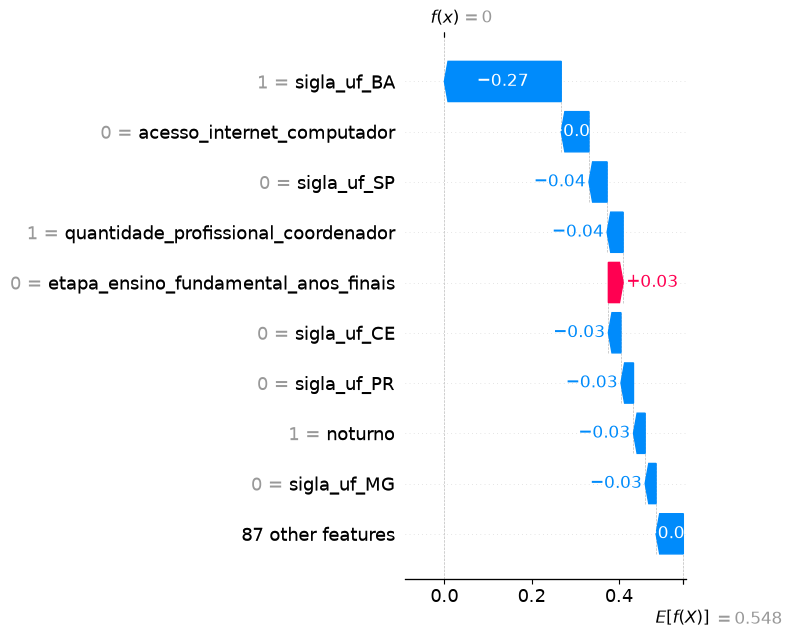 | 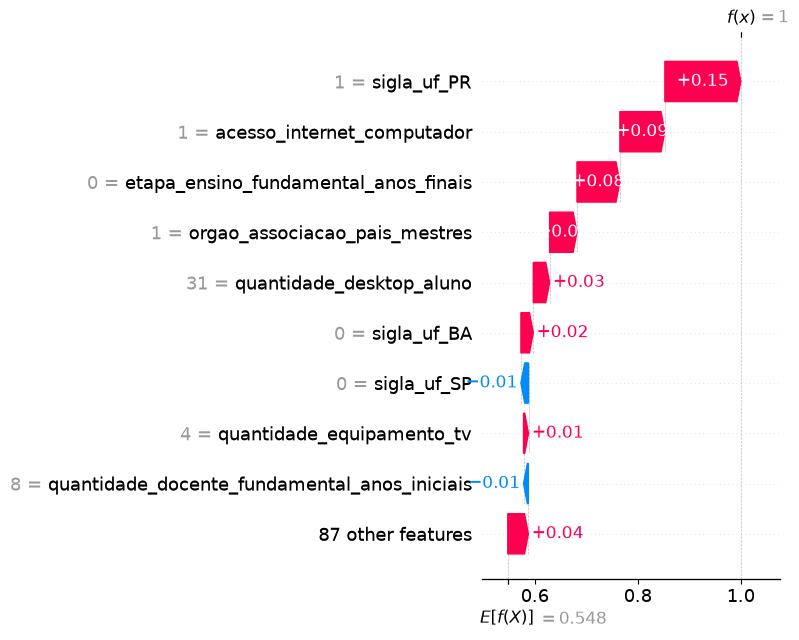 |

## 9. Insights encontrados

Respostas completas em `reports/insights.md`. Em resumo:

1. **O estado é o fator de maior peso agregado**, seguido do acesso a internet e computador na escola, da oferta ou não dos anos finais do fundamental, da presença de equipamento de TV/multimídia, da associação de pais e mestres e do saneamento básico.
2. **Escolas que oferecem só os anos iniciais batem a meta em 60,5% dos casos, contra 47,8% das que também oferecem os anos finais** (diferença de quase 13 pontos percentuais). É compatível com a hipótese de foco no ciclo avaliado, mas é um padrão observado, não uma causa comprovada.
3. **Risco médio previsto por região:** Norte 0,68 e Nordeste 0,64, contra Sudeste 0,30 e Sul 0,24. As cinco UFs de maior risco são Bahia, Maranhão, Rio Grande do Norte, Pará e Sergipe; oito dos dez municípios de maior risco médio são baianos.
4. **Priorização:** 18.252 escolas (43,2% da base) entram em alguma faixa de risco: 2.651 em prioridade Alta (risco ≥ 0,90), 3.396 em Média (0,80 a 0,90) e 12.205 em Baixa (0,50 a 0,80), concentradas no Nordeste. As dez escolas de maior risco são todas da Bahia, com risco previsto 1,0, e todas de fato ficaram abaixo da meta, o que dá confiança na calibração do modelo nesse extremo.
5. O Ceará aparece como exceção positiva dentro do Nordeste, um padrão conhecido em política educacional que o modelo capturou sem nenhuma informação específica sobre isso.

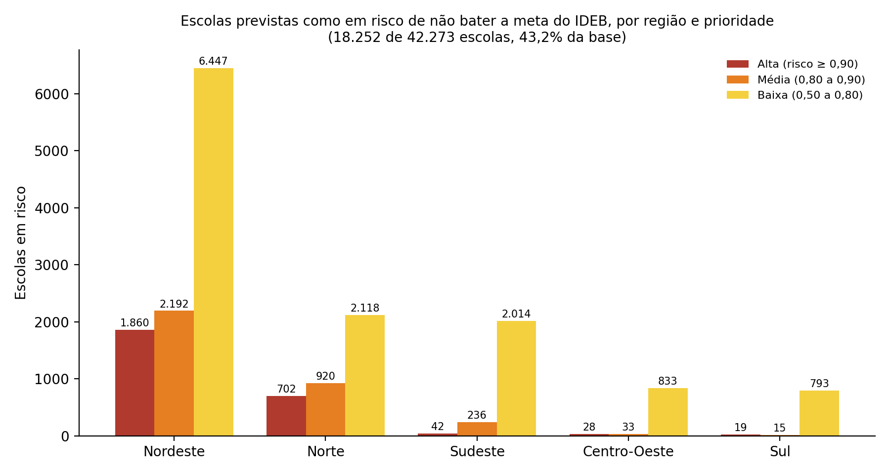

## 10. Limitações do projeto

- **Correlação não é causalidade.** TV na escola ou associação de pais e mestres provavelmente são proxies de um pacote maior de investimento e gestão, não causas diretas. O mesmo vale para `sigla_uf`, que resume governança, financiamento e contexto socioeconômico estaduais.
- **O IDEB de anos iniciais é um recorte** do desempenho educacional, não a mesma variável de alfabetização por aluno do enunciado original. A reformulação está justificada na seção 4, mas é uma escolha com consequências de interpretação.
- **Alinhamento temporal aproximado:** Censo 2024 pareado com o ciclo 2025 do IDEB, sob a premissa de que infraestrutura escolar muda pouco de um ano para o outro.
- **Variáveis socioeconômicas do município** (IDH-M, renda) não entraram; ajudariam a separar o efeito da escola do efeito do território.
- **Modelo nacional único.** O peso de `sigla_uf` sugere que cada estado tem uma dinâmica própria; um modelo por estado ou região tende a capturar melhor os padrões locais.
- O modelo tem acurácia de 0,73: é uma ferramenta de priorização, não um veredito sobre cada escola.

## 11. Aplicação prática para políticas públicas

O produto do modelo é uma lista de escolas com probabilidade de não bater a meta, organizada em três faixas de prioridade e agregável por município, UF e região. Na prática, isso permite começar a ação pelas 2.651 escolas de prioridade Alta (a maioria no Nordeste), planejar por secretaria estadual ou municipal, e pontuar também as escolas que ainda não têm IDEB publicado. Como as features são características observáveis da escola, o mesmo modelo indica onde há alavancas: acesso a internet e computador, saneamento, estrutura de gestão participativa. A explicação individual via SHAP responde "por que esta escola foi marcada", que é o que um gestor precisa para defender uma intervenção.

## 12. Implantação em produção (proposta)

O que fiz aqui rodou localmente, como deve ser numa fase de desenvolvimento: entender o problema, montar a base, iterar. Para virar um processo recorrente, a esteira (faixa inferior do diagrama da seção 5) seria:

1. **Orquestração:** um job agendado (Airflow, AWS Step Functions ou mesmo um cron) que, a cada novo Censo Escolar e ciclo do IDEB, roda `build_base_escola.py` e republica a camada `silver_modelo` no S3.
2. **Retreino em nuvem:** `python -m src.modeling.treinar_modelo_final` rodando em uma máquina maior (EC2 ou SageMaker Training), com a base inteira, comparando as métricas com a versão anterior antes de promover o modelo.
3. **Registro do modelo:** versionamento do `.joblib` (S3 com versionamento, MLflow ou SageMaker Model Registry), com métricas de validação e a data do Censo usada.
4. **Previsão:** em lote, com `python -m src.modeling.prever` gerando a lista de escolas por prioridade a cada ciclo; ou em tempo real, expondo o mesmo pipeline salvo em um endpoint (SageMaker Endpoint ou uma API com FastAPI) para pontuar uma escola por vez. Como o pipeline salvo já inclui o pré-processamento, as duas formas usam o mesmo artefato.
5. **Consumo:** painel para gestores (lista Alta/Média/Baixa por UF e município) em uma ferramenta de BI ou planilha integrada à secretaria.
6. **Monitoramento:** drift das features entre Censos, acurácia real quando o IDEB novo é publicado, e reavaliação a cada ciclo.

Ferramentas sugeridas, todas compatíveis com o que já existe no projeto: S3 (dados e artefatos), EC2 ou SageMaker (treino e inferência), Airflow ou Step Functions (orquestração), MLflow ou Model Registry (versionamento), CloudWatch ou Evidently (monitoramento).

## 13. Possíveis evoluções futuras

- Modelos por estado ou região, ou um modelo hierárquico, para capturar dinâmicas locais que o modelo nacional resume em `sigla_uf`.
- Enriquecimento com variáveis socioeconômicas do município (Atlas do Desenvolvimento Humano, PNAD).
- Uso do histórico de IDEB da escola (ciclos anteriores) como feature, com cuidado para não vazar o resultado atual.
- Indicador complementar de não participação na avaliação (ausência e prova não preenchida), que na EDA de aluno mostrou um padrão regional diferente do padrão de alfabetização.
- Testar ensembles com interpretabilidade pós-hoc, se o ganho de acurácia justificar a perda de legibilidade.

## 14. Como reproduzir

Requisitos: Python 3.12 ou superior (desenvolvido em 3.14) e credenciais de leitura no S3 do projeto.

```bash
python -m venv .venv
.venv\Scripts\activate          # Windows (no Linux/macOS: source .venv/bin/activate)
pip install -r requirements.txt
copy .env.example .env          # preencher com as credenciais AWS
```

Ordem de execução:

1. `python -m src.preprocessing.build_base_escola` monta a base de escolas (cache local em `data/processed/`) e publica a camada `silver_modelo`.
2. `python -m src.preprocessing.pipeline` testa o pré-processador (fit no treino, transform na validação).
3. Notebooks em ordem numérica: `notebooks/eda/00` a `08` (exploração e seleção de features) e `notebooks/modelagem/09` a `12` (baseline, otimização, interpretabilidade).
4. `python -m src.modeling.treinar_modelo_final` treina o modelo final fora de notebook e salva `models/arvore_decisao_final.joblib` (o arquivo versionado no repositório foi gerado pelo notebook 12 com a mesma configuração).
5. `python -m src.modeling.prever` carrega o modelo salvo e gera `data/processed/previsoes_escolas.csv` com probabilidade, risco e prioridade por escola, sem retreinar.

Todo `random_state` está fixado em 42, então o split e o modelo são reproduzíveis.

## 15. Estrutura do repositório e documentação

```
├── data/                         # dados locais (não versionados, vêm do S3)
├── images/                       # gráficos exportados dos notebooks e diagrama do pipeline
├── models/
│   └── arvore_decisao_final.joblib   # pipeline completo treinado (pré-processamento + árvore)
├── notebooks/
│   ├── eda/                      # 00 a 08: exploração, reformulação do problema, seleção de features (README próprio)
│   └── modelagem/                # 09 baseline, 10 otimização, 11 busca avançada da árvore, 12 interpretabilidade
├── reports/
│   ├── decisoes.md               # anexo técnico: log cronológico de todas as decisões (Achados 1 a 44)
│   ├── insights.md               # respostas às 5 perguntas de negócio
│   └── referencias/selecao_features_revisado.csv   # decisão coluna a coluna das features
├── src/
│   ├── preprocessing/            # load_data.py, build_base_escola.py, pipeline.py, simple_eda.py
│   ├── modeling/                 # treinar_modelo_final.py, prever.py
│   ├── evaluation/               # metricas.py
│   └── visualization/            # graficos.py
├── requirements.txt
├── .env.example
└── .gitignore
```

**Como a documentação se organiza.** Este README é o resumo. `reports/decisoes.md` é o anexo técnico: um registro cronológico, numerado em "Achados", de cada decisão tomada e do motivo, inclusive as que foram revistas depois; os notebooks e o `insights.md` citam os achados por número. `notebooks/eda/README.md` conta a investigação que levou à reformulação do problema. `reports/insights.md` traz as respostas formais às perguntas de negócio.

**Versionamento.** O trabalho foi feito em branches por etapa (`feature/analise-exploratoria`, `feature/modelagem-baseline`, `feature/otimizacao-modelo`, `feature/interpretabilidade-e-finalizacao`), integradas na `dev` por pull request e consolidadas na `main` ao final.
